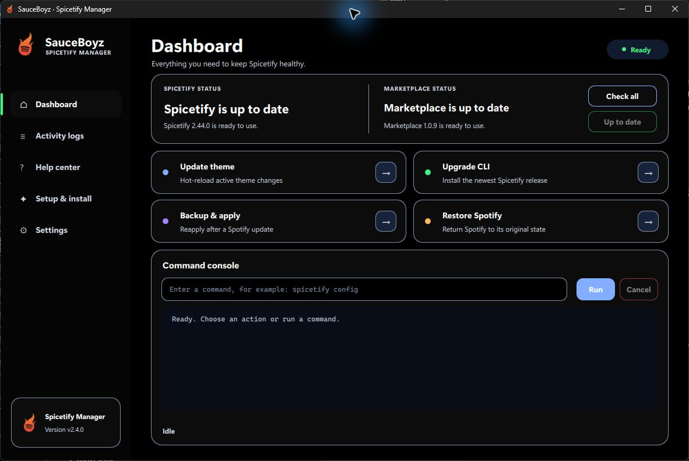
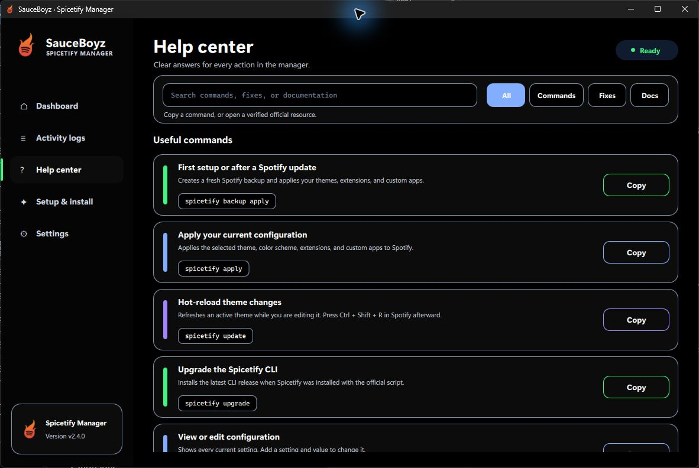

<div align="center">

# Spicetify Manager

**A fast, beginner-friendly Windows desktop manager for Spotify and Spicetify.**

[](https://github.com/itourboy-OG/Spicetify-Manager/releases/latest)
[](https://github.com/itourboy-OG/Spicetify-Manager/releases/latest)
[](LICENSE)

[Download](#download) · [Features](#features) · [Help Center](#built-in-help-center) · [Changelog](CHANGELOG.md) · [Build from source](#build-from-source)

</div>



Spicetify Manager turns the most useful Spicetify commands into a polished
desktop application. It detects your setup, guides first-time installation,
keeps the CLI and Marketplace current, and makes recovery tasks understandable.

## Download

Download the newest installer from the
[Releases page](https://github.com/itourboy-OG/Spicetify-Manager/releases/latest):

1. Download `Spicetify-Manager-v2.4.0-Setup.exe`.
2. Run the installer.
3. Keep **Create a desktop shortcut** selected.
4. Open Spicetify Manager and use **Setup & install** if this is your first time.

> [!NOTE]
> The current community build is unsigned, so Microsoft Defender SmartScreen
> may display a warning. Source code and build instructions are available in
> this repository for review.

## Features

- Detects desktop Spotify, Microsoft Store Spotify, and the Spicetify CLI
- Installs, upgrades, repairs, restores, or fully removes Spicetify
- Detects and safely updates the separate Spicetify Marketplace
- Reapplies customizations after Spotify updates
- Streams command output with cancellation, progress, and completion percentage
- Keeps useful activity logs with search, export, clear, and delete controls
- Checks GitHub for application updates and verifies installer downloads
- Includes Standard, Large Text, and High Contrast accessibility modes
- Uses a responsive Qt Quick interface with smooth GPU-accelerated transitions
- Stores settings and logs privately in the current Windows account

## Built-in Help Center

The searchable Help Center includes copyable commands, troubleshooting
workflows, category filters, and verified links to official Spicetify,
Marketplace, GitHub, and Spotify documentation.



## Requirements

- Windows 10 or Windows 11
- Desktop Spotify from [spotify.com](https://www.spotify.com/download/windows/)
- Python 3.10 or newer only when running or building from source

The installer includes the Python and Qt runtime required by the application.
Your friends do not need to install Python.

## Run from source

Clone the repository and launch:

```bat
spicetify.bat
```

The launcher creates `.venv`, installs the pinned Qt dependency, and starts the
manager.

## Build from source

Create the portable application:

```bat
build-release.bat
```

Create the Windows installer with
[Inno Setup 6](https://jrsoftware.org/isinfo.php) installed:

```bat
build-installer.bat
```

The installer is written to:

```text
installer-output\Spicetify-Manager-v2.4.0-Setup.exe
```

Optional Authenticode signing is documented in
[CODE_SIGNING.md](CODE_SIGNING.md). The full release checklist is in
[DISTRIBUTION.md](DISTRIBUTION.md).

## Privacy and safety

- Spicetify commands run locally on your computer.
- Settings and logs stay under your local application-data folder.
- Downloaded updates are verified before they are opened.
- Help Center links are restricted to trusted Spicetify, GitHub, and Spotify
  domains.

## Disclaimer

Spicetify Manager is an independent community project. It is not affiliated
with Spotify or the Spicetify project. Spotify and Spicetify are separate
third-party applications governed by their own licenses and terms.

## License

Released under the [MIT License](LICENSE).
